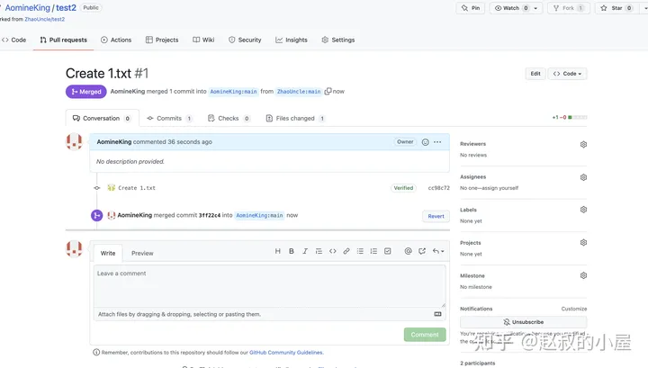

### 介绍
提交代码作业
由于需要不断调试、重构和迭代代码，方便版本管理
定义
- 分布式版本控制
- 作者：Linus
* 安装
https://git-scm.com/downloads
### 配置
```bash
mkdir learn_git
cd learn_git
ls -alF

# 初始化
git init

ls -alF
.git/

# 配置

git config --global user.name "Chen Xiaohui"
git config --global user.email "ysucxh@163.com"

# 检查
git config --global --list
```
* System: 系统级配置，包含系统里每位用户及他们拥有的仓库的配置值，git安装目录\etc\gitconfig, 优先级最低
* Global: 全局配置，包含当前系统用户的拥有的仓库的配置值，每个系统用户的全局配置相互隔离，当前系统用户的主目录\.gitconfig文件内。可覆盖系统级配置。常用，配置账号、邮箱。
* Local: 本地仓库，当前仓库的.git\config文件，这里的配置仅对当前仓库有效，不影响其他仓库，优先级最高，如果全局级别或系统级别的配置里面出现了同一配置项，则以本地级别配置内容为准
### 简单操作
```bash
# 查看仓库状态
git status

# 文件状态：已修改
# 工作区 - working directory
> learn_git.html
git status
git diff 查看修改内容

# 文件状态：已暂存
# 暂存区 - staging area
git add learn_git.html
git status

# 已提交
# Git仓库 - repository
git commit -m "create learn_git.html"
git status

# 添加内容
cat <<EOF | tee >learn_git.html
<!DOCTYPE html>
<html>
<head>
        <title>Learn Git</title>
</head>
<body>
        <h1>Hello Git</h1>
</body>
</html>
EOF

git status

git add learn_git.html
git add .
git status

git commit -m "web1.0"
git status

# 显示所有提交
git log
```
### 将本地仓库同步到远程GitHub仓库
在分支操作时候保证本地工作区、暂存区是干净的
分支操作：
```yaml
- Git merge
- Git pull/push
```


```bash
# 配置远程仓库，远程仓库在本地的名称叫origin
git remote add origin git@github.com:UiPath-Chen/golang.git

# 配置上游仓库，上游仓库在本地的名称upstream,上游仓库通常指的是你的fork的源头，有时候，那个源头有修改，需要更新现有的代码。
git remote add upstream git@github.com:cncamp/golang.git

# 查看远程仓库
git remote
git remote -v[--verbose]
git remote show [远程仓库名称]


# 配置SSH
ssh-keygen -t rsa -C "ysucxh@163.com"
cd /c/Users/Lenovo/.ssh/
cat id_rsa.pub
# 复制到GitHub上

# 测试是否可以远程连接github
ssh -T git@github.com

# 更新fork源头到本地Git仓库
git fetch upstream master
## git pull = git fetch + git merge
git pull upstream master
## 将本地分支代码合并到目标分支
git merge 目标分支名称

## 开发代码，提交到本地

# 上传
## 查看分支
git branch

## 创建分支
git branch 本地分支名
## 切换分支
git checkout 本地分支
## 创建并切换分支
git checkout -b 本地分支名称

git push
git push <远程仓库> <本地分支名>:<远程分支名>

-u 当本地存在dev分支，而远程没有dev分支，此时，可将本地所在分支dev，推送到远程dev，如果远程没有dev，创建一个
git push --set-upstream  [远程主机名] [远程分支名]
git push -u origin master
git push -u origin main

或者可以强制推送本地mater到远程master,不推荐
git push -f master master
```
### 将上游仓库同步到远程仓库
https://www.zhihu.com/question/28676261/answer/2323707750
1. 查看different
登录GigHub，点击Code

2. 代码不冲突
登录GigHub，点击Code
#### 方法一：Fetch and merge


#### 方法二：Pull requests
：注意，一定是从源仓库，也叫做上游upstream，-->> merge 到，本地仓库，箭头方向一定要对



3. 命令行同步复制
git remote add upstream https://github.com/ORIGINAL_OWNER/ORIGINAL_REPOSITORY.git

$ git remote -v
> upstream  https://github.com/ORIGINAL_OWNER/ORIGINAL_REPOSITORY.git (fetch)
> upstream  https://github.com/ORIGINAL_OWNER/ORIGINAL_REPOSITORY.git (push)

git fetch upstream

git checkout main

git merge upstream [main]

git push [origin main]


### SSH密钥
https://docs.github.com/zh/authentication
### DNS解析污染
由于国内墙, 导致若使用代理去解析github.com, 根本无法控制DNS会解析到好用的地址，所以不如直接使用其原始地址,一劳永逸
https://www.ipaddress.com/
 /etc/hosts 或 C:\Windows\System32\drivers\etc\hosts
140.82.112.4 github.com
### 注意
国内连接 GitHub 网速可能会比较慢，大家也可以使用 Gitee（ https://gitee.com/ ）来代替，两者的功能和使用方法是类似的。
Gitee 相关操作文档：
-  https://gitee.com/help/articles/4120
-  https://gitee.com/help/articles/4122