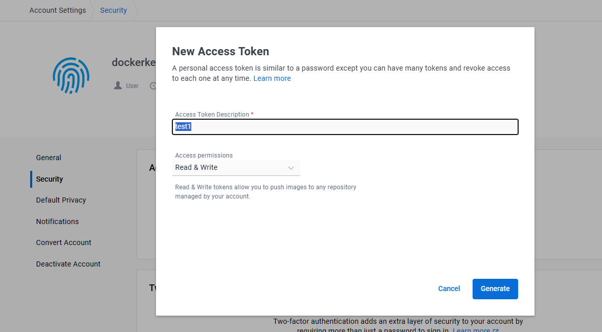
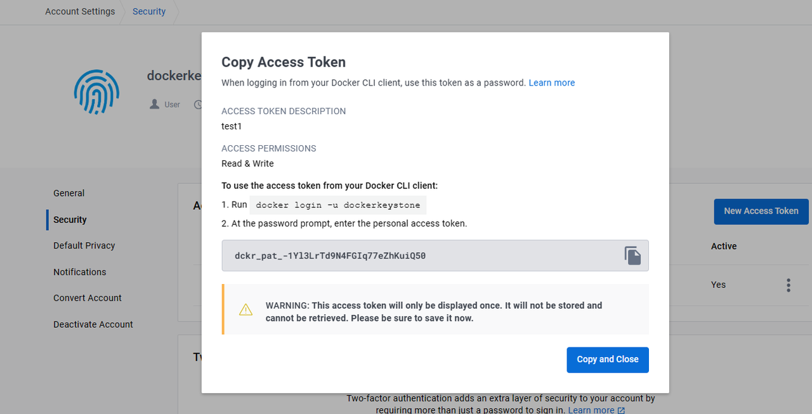

### 官网
https://github.com/GoogleContainerTools/kaniko

### 获取hub.docker.com凭据
#### 生成Token
hub.docker.com登录 -》 Account Setting -> Security -> New Access Token
填写：
- 描述信息
- 授权：read & write 必须有, 其他随意

-》Generate

#### base64编码
>echo -n username:token |base64 -
dckr_pat_X40FcdrZAWO2omOw_VtgfZpumaQ

```bash
echo -n dockerkeystone:dckr_pat_X40FcdrZAWO2omOw_VtgfZpumaQ | base64 -
```
>ZG9ja2Vya2V5c3RvbmU6ZGNrcl9wYXRfWDQwRmNkclpBV08yb21Pd19WdGdmWnB1bWFR
### 配置凭据
nano config.json

```json
{
    "auths": {
        "https://index.docker.io/v1/": {
            "auth": "ZG9ja2Vya2V5c3RvbmU6ZGNrcl9wYXRfWDQwRmNkclpBV08yb21Pd19WdGdmWnB1bWFR"
        }
    }
}
```
开始构建镜像

```bash
docker run \
-v "$HOME"/.docker/config.json:/kaniko/.docker/config.json \
-v /path/to/context:/workspace \
gcr.io/kaniko-project/executor:latest \
--dockerfile /workspace/Dockerfile \
--destination "$PROJECT_ID/$IMAGE_NAME:$TAG" \
--context dir:///workspace/
```

>-v "$HOME"/.docker/config.json:/kaniko/.docker/config.json : 将本地凭据挂载到容器中的/kaniko/.docker/config.json； docker registry 推送凭据
-v /path/to/context:/workspace：将当前位置挂载到容器中的/workspace; 构建的源码
gcr.io/kaniko-project/executor:latest  -- 启动的镜像; kaniko 容器
--dockerfile /workspace/Dockerfile： 容器中的构建镜像配置； dockerfile
--destination "$PROJECT_ID/$IMAGE_NAME:$TAG" ： 推送位置; 指定目标镜像仓库地址，默认dockerhub
--context dir:///workspace/ ： 默认的构建上下文; 上下文，支持本地目录，还支持git仓库

```bash
docker run \
-v config.json:/kaniko/.docker/config.json \
-v .:/workspace \
gcr.io/kaniko-project/executor:latest \
--dockerfile /workspace/Dockerfile \
--destination dockerkeystone/test-app:v1.0 \
--context dir:///workspace/
```
### 日志查看
```bash
docker ps
docker logs -f container-id
```