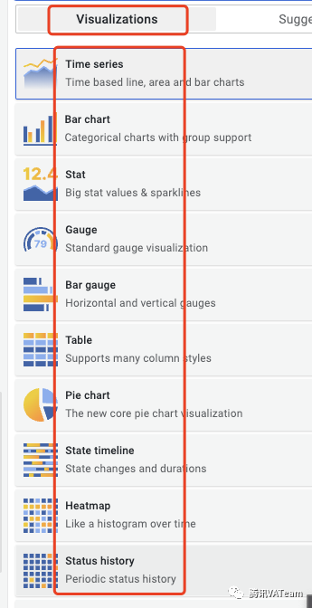

### 资料
[看完这篇，成为Grafana高手！](https://zhuanlan.zhihu.com/p/580145725)

### 下载
https://grafana.com/get/

### 概念

- 数据
- 图表：Visualization
  - Time series:时间序列
    - style: ["Lines", "Bars", "Points"]
    - Fill opacity: 3
    - Gradient mode: scheme
  - Bar chart:条形图
  - Stat:单一状态图
  - Gauge:仪表盘
  - Bar gauge:条形测量
  - Table:表格
  - Pie chart:饼图
  - State timeline:状态时间线
  - Heatmap:热图
  - Status history:状态历史记录
  - text: 文本（支持Markdown和HTML）
- dashboard: 看板
- panel: 面板
###