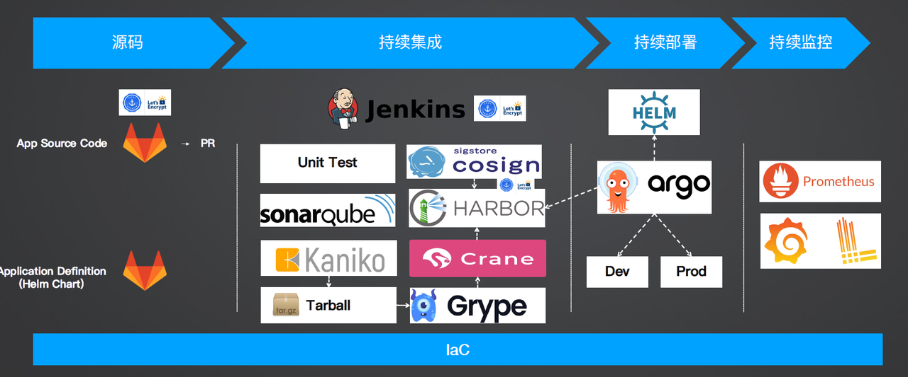

# DevOps全流程
Terraform - Terraform是您和云提供商API之间的一层。它使您能够将自动云配置提升到新的高度。Terraform可以帮助您将云基础设施写成代码。这意味着您可以准确地定义您的应用程序需要什么，Terraform将在云中远程配置这些资源。
## 源码
---
```bash
Cert Manager - SSL证书申请，配置gitlab访问方式为TLS
GitLab - 自托管，代码仓库管理
  - App Source Code: Go 微服务
  - Application Definition: Helm Chart
```
## 持续集成 - CI
---
当开发者commit一次提交或PR时，触发Jenkins构建
Jenkins拉取代码
```bash
Jenkins - 单元测试
Sonarqube - 代码扫描，质量门禁，代码重复率、安全性、可维护性
Kaniko - Google开源，构建镜像，安全性高
  # 不推荐使用DIND - docker in docker 方式构建，
  # 原因
    1. 需要把docker socket 挂载到pod中，不安全；
    2. 运行效率低，占用资源大
      3. 需要docker deamon， 而Kaniko只需要pod就能构建镜像
Tarball - 打包镜像，类似docker save -o 将指定镜像保存成 tar 归档文件
Grype - 镜像Tar包扫描，漏洞(包括业务代码的依赖包的安全漏洞)，镜像的依赖  # trivy
Crane - 将Tarball转换为镜像，并推送到Harbor
HARBOR - 存储镜像 # jfrog
需要SSL证书，使用Cert Manager自动申请证书
COSIGN - 镜像签名，把证书签到镜像中；证明镜像是通过镜像流水线生成的，而不是通过本地构建放到HARBOR中的。
```
grype漏洞扫描支持语言：


## 持续部署 - CD
---
ARGO CD监控HARBOR中的镜像的变更
持续部署

```bash
Argo - 类似K8s, 部署镜像， image update 实时查看HARBOR是否有新的镜像
  1. 模拟2套环境, 对应GitLab的分支
Dev/Prod
  2. 把HARBOR内的新版本镜像，主动将HELM Chart（一个Chart包含了一组K8s资源集合的描述文件）写入GitLab的仓库Application Definition中
HELM - 应用定义, Helm Chart；类似YUM
```
## 持续监控
```bash
持续监控
Open Telemetry - 分布式追踪，微服务之间的调用
Prometheus - 监控
Grafana - 看板
Loki - 日志，属于Grafana
Alertmanager -
Lens - 容器监控
  https://k8slens.dev/
  https://github.com/lensapp/lens
  https://api.k8slens.dev/binaries/Lens-#{version}-latest#{arch}.dmg
  version: 2023.8.231521
  arch: -arm64
  lens 不同版本，字符串替换一下，不同 CPU 架构的自行修改
```
## 灾备
VELERO - 集群、数据库备份