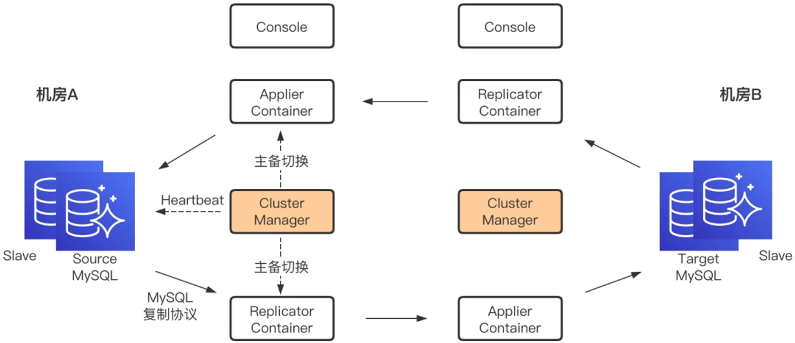
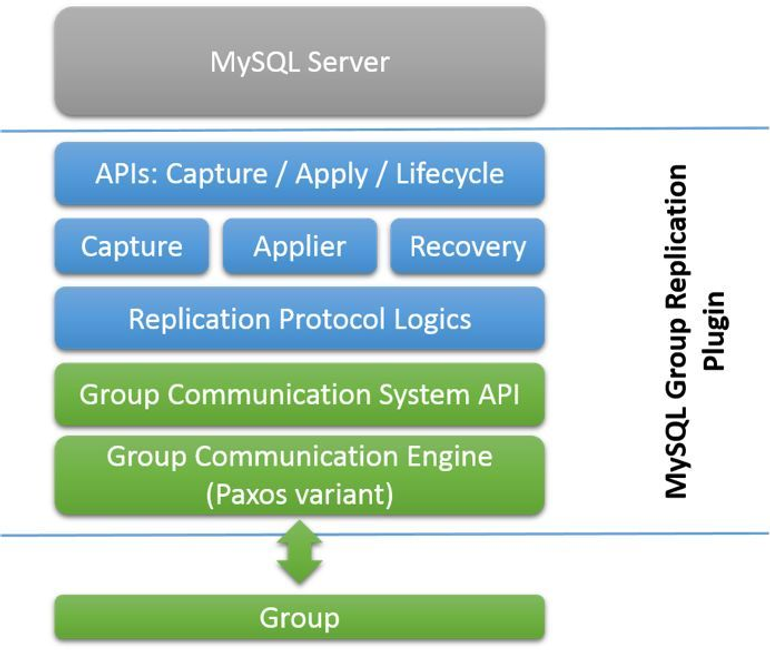

# mysql on kubernetes
https://cncamp.notion.site/mysql-on-kubernetes-eb043ee841dc41618ce4798bca187bbf

## 某电商

单主模式

一个mysql集群包括一个master点和2个slave节点。所有写操作都要经由master节点，在承担数据冲突风险的前提下，亦可从slave节点写入。

当前配置是将数据库cname(FQDN)指向master节点，当master节点出现故障时，dba team利用工具将一个slave节点切换成主节点并将cname指向新的master。

单主的主要挑战是，多地域部署的应用代码访问主节点时的延迟不一致。

通过cname切换访问入口带来的问题是dns ttl cache。

**读写分离**

默认情况下，用户只知道master的cname，读写均从此cname进行，用户是不知道其他访问入口的。需要承担的代价是跨域访问的高延迟。

针对某些比较大的读操作（比如拉报表数据），可能会影响master性能，业务需要找DBA提需求，DBA会将slave的地址共享给业务，业务需要承担的代价是，写入master后，到数据sync到slave的延迟。这个延迟在毫秒级，业务基本可以承受。

**分库分表**

如果数据量大，则会分离数据库，比如用户信息，商品信息，交易信息，需要dba与业务约定分库的规则，比如按照某些重要属性做sharding，业务既定规则决定访问哪个数据库instance。

**故障处理**

如果slave出现故障，做failover就好了。

如果master出现故障，则涉及到域名切换，TDO（site admin）会在配置中心mark down掉数据库应用实例，业务看到mark down以后，会暂停数据库访问直到恢复。

多主模式（很少用）

支持Galera cluster，所有节点都是主节点，不同节点部署在不同数据中心。客户端通过DAL层实现就近访问。

只有低IO需求的DB能运行在此模式，因为双向同步显著降低DB性能。

[Galara Operator Details](https://www.notion.so/Galera-Operator-54feb25580114862ae1ccfbf133af1a3?pvs=21)

## 友商

### **携程**

DRC双向复制

!https://s3-us-west-2.amazonaws.com/secure.notion-static.com/d76ef36a-842b-4741-ac38-6701f871a710/Untitled.png

主要思想是，不同地域部署不同的mysql集群，比如在region A部署mysql cluster A，在region B部署mysql cluster B。

主要组件包括：

- Replicator
    - 主replicator将自己伪装成一个slave，实现binlog的拉取和本地存储。
    - 从replicator从主replicator获取binlog
- Applier
    - 从Replicator拉取binlog，解析出sql语句并应用到目标mysql
- Cluster Manager
    - 负责mysql主从切换导致的Replicator和Applier的重启

冲突处理：

若出现冲突，则以时间戳为准，靠后的被采用，或交由用户处理。
1. 看时间戳，时间戳覆盖；
2. 同时保留数据，等待人工处理；

3.MGR模式（本质上跟etcd的实现差别不大，未上生产）

基于Paxos协议的数据复制模块和冲突监测模块，Paxos协议中，master节点执行事务后，在commit之前，通过心跳将binlog通知slave确认，当半数以上节点确认以后，进入certify阶段。certify校验transaction message，其中包含writeset（hash of主键）和gtid_executed（本质是版本信息），certification info包含之前通过校验的writeset和gtid_executed信息，如果transaction message中的gtid大于certification info中的版本信息，则通过，否则冲突。

!https://s3-us-west-2.amazonaws.com/secure.notion-static.com/49afb342-f1c8-44b8-a437-68bc15a3ff29/Untitled.png

### **阿里**/蚂蚁

oceanBase

基于paxos协议实现数据同步

目前还是单主模式，主要原因是多主的冲突处理在工程实践上有难度。（比如时间戳是否可信）

业务开发部门按需将表拆分，比如按地域将用户表纵切，配合前端的用户就近访问，可以使应用访问本地数据库。

### **VIP**

与eBay模式一致，目前还在单主模式，今年会尝试多主。

github上能看到DRC的repo，但是因为团队解散等原因，没有应用到生产系统。

h[ttps://github.com/vipshop/drc](https://github.com/vipshop/drc)

### **华为**

没问到，容器云平台离DB落地比较远，没有context

[Galera Operator](https://www.notion.so/Galera-Operator-54feb25580114862ae1ccfbf133af1a3?pvs=21)

