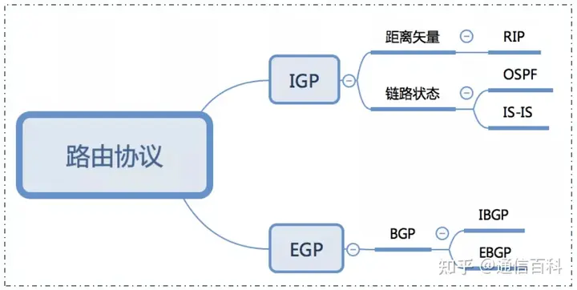
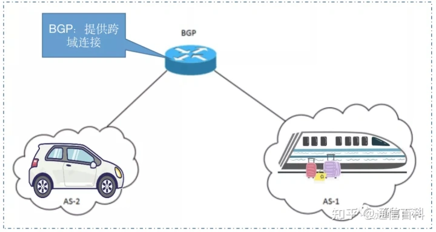
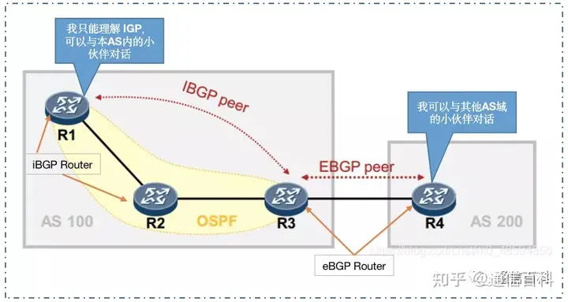
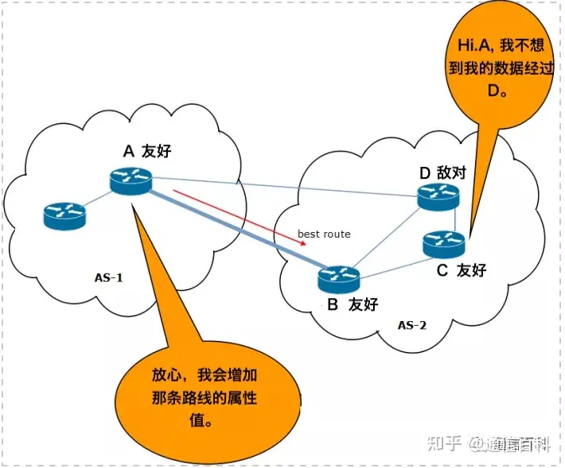

# BGP
> 路由协议
路由协议被分为EGP和IGP两个层次,没有EGP就不可能有世界上各个不同组织机构之间的通信,没有IGP机构内部也就不可能进行通信。下面我们就来看看EGP协议中的BGP协议是做什么的。

> 自洽系统
BGP表示边界网关协议-Border Gateway Protocol，如同RIP、OSPF等IGP协议一样，也是一种路由协议。但与IGP所不同，它是自治系统AS之间的路由协议。那么什么是自治系统 (AS) ？
>
> 让我们设想一个场景，你和你的的朋友计划到张家界旅游。现在有两种出行的方式：你可以乘坐公共汽车或自驾前往。如果你打算乘高铁，那么就必须同意高铁的一些规则，比如说例如车费、停站次数、到达目的地的路线等。但是如果你选择自驾，就可以定义自己的行程。如下图所示。

> 如上图所描述的，高铁和自驾小车的驾驶者都定义了他们自己的路由策略。在这里，我们就可以将高铁和小车看作为两个自治系统AS，它们拥有自己的Policy、管理条款，只要同意这些政策的任何用户都能成为该 AS 的一部分。因此，自治系统是受共同管理权限的设备的集合。因此，在 Internet 中，我们可以说一个电信服务商提供商 (ISP)下的客户创建一个 AS。

接下来，我们假设你的一位朋友决定在乘坐两站高铁后加入搭乘你的小车。在这种情况下，你就必须知道高铁所走的路线、第3次停靠的时间以及停留多长时间，以便可以顺利的接上你的朋友，这就需要你与处于高铁自治系统AS里的朋友进行互动，这样跨域通信就来了。

如上图所示，我们的BGP就可以帮助你与你的朋友进行联系。可以认为你的朋友充分利用你的小车和高铁所定义Policy的优点。

因此，BGP是AS之间协议（在AS自治系统内则使用IGP 协议）。与IGP 路由协议不同，BGP不提供有关度量Metric或链路状态的路由，但它会选择涉及较少AS数量的一条路径。众所周知，互联网都是关于ISP的，BGP在这些ISP之间建立连接，并基于AS的策略Policy，通过BGP来选择控制路由。因此，BGP就是互联网协议。

通过上面的简单介绍，我们知道了BGP 是自治系统间AS协议，我们也知道什么是自治系统AS，下面我们继续看BGP协议的其他方面。如下图所示。

从上面的网络拓扑可以看出，BGP分为内部BGP（iBGP）和外部 BGP（ eBGP）协议两种类型。连接两个AS间的路由器使用的是eBGP协议。而AS内部连接的路由器使用的是iBGP协议。AS域内的所有路由器都使用IGP协议，它们不知道运行iBGP的路由器。

另外，我们知道，在路由协议中，邻居的重要性也不言而喻，远亲不如近邻。在BGP网络中，当我们需要传递信息时。就需要识别邻居。以便对转发路由进行更新。在这里，我们需要知道，BGP中的邻居是必须手动配置的，但是它们之间并不要求必须是直接相连的。只要没有被识别定义为邻居，那么它们之间就不能传递信息。这就是为什么AS内的所有iBGP路由器都必须配置为彼此的邻居（如同全网Mesh连接），否则路由更新将不会发送给这些路由器。

在这里，来自邻居的路由更新将存储在本地BGP表中，来自该表的最佳路由被录入到路由表中。当然我们也可以假设与某个AS所有者正在进行冷战，不希望在我们的AS内允许通过那个AS的任何数据流。那么，就可以配置所属我们AS的属性、权重、本地优先级、AS 路径等来达成这个目的。并且还可以根据这些属性值，选择一条路由作为最佳路径。此外，如果有多个路径到达目的地，在这种情况下，属性也用于决定选择哪条路径。如下图所示。

综上，BGP协议是一个非常重要的协议。它属于外部网关路由协议，可以实现自治系统间**无环路**的域间路由。BGP是沟通Internet广域网的主用路由协议。还是那句话：没有EGP就不可能有世界上各个不同组织机构之间的通信，只有BGP、IGP共同进行路由控制，才能够进行整个互联网的路由控制。