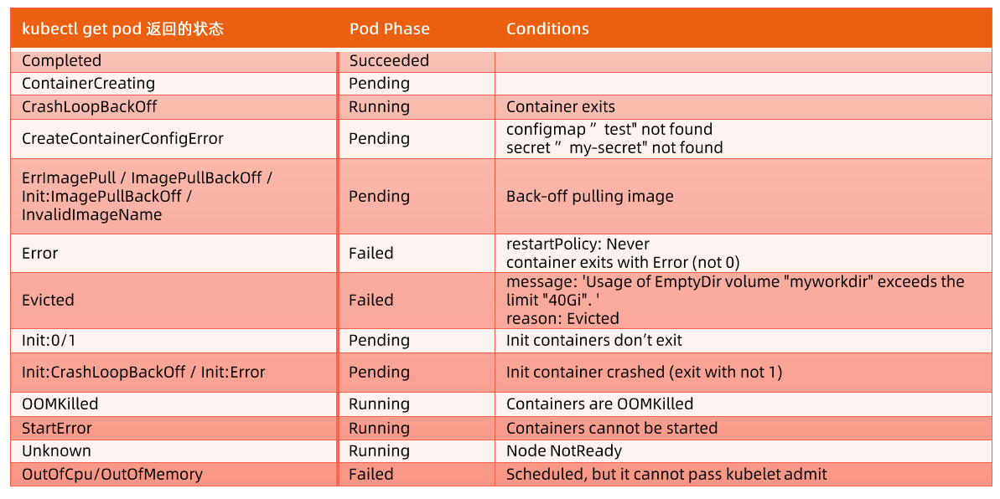

# 1. Pod debug
- [1. Pod debug](#1-pod-debug)
    - [1.0.1. Check Pod Name \& Ready \& Status](#101-check-pod-name--ready--status)
    - [1.0.2. Check Pod Phase: Status](#102-check-pod-phase-status)
    - [1.0.3. Check Pod Conditions: Ready](#103-check-pod-conditions-ready)
    - [1.0.4. Check Pod Event](#104-check-pod-event)


### 1.0.1. Check Pod Name & Ready & Status
```bash
kubectl get po -o=wide
```

### 1.0.2. Check Pod Phase: Status
Pod生命周期的阶段

```bash
kubectl get po <Pod Name> -o=yaml |yq '.status.phase'
```

### 1.0.3. Check Pod Conditions: Ready
conditions都为true时，Ready才为100%

```bash
kubectl get po <Pod Name> -o=yaml |yq '.status.conditions'
```

### 1.0.4. Check Pod Event
```bash
kubectl describe po <Pod Name>
``````


